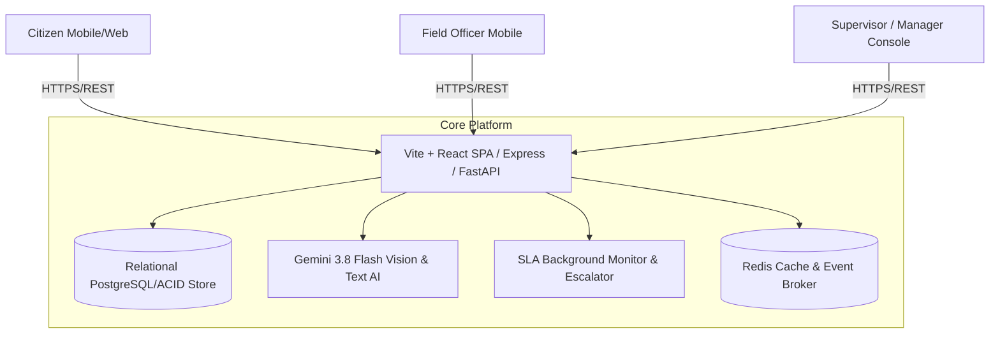

# CivicFix — System Architecture

CivicFix is designed as a high-reliability, modular civic technology platform connecting citizens, municipal departments, field crews, and executive leadership.

## Architecture Overview

## Core Subsystems

1. **Client Layer (Vite + React 19 + TypeScript + Tailwind CSS)**:
   - Citizen reporting wizard with real-time GPS pinpointing, camera evidence capture, and AI preview.
   - Interactive Leaflet map with priority pins, geolocation, and popup previews.
   - Field Crew mobile-first console with one-tap status toggling (`Start Work`, `Pause Work`, `Mark Resolved`).
   - Supervisor workload triage and re-assignment dashboard.
   - Executive Analytics with KPI counters, daily activity histograms, and CSV report export.

2. **Application & API Layer (Node.js Express + Python FastAPI)**:
   - Full REST API endpoints for authentication, issues, status transitions, comments, internal notes, audit logging, and SLA policies.
   - Background SLA monitoring loop running every 60 seconds.
   - Real-time audit trail recording every state change and user action.

3. **AI Vision & Copilot Layer (Gemini 3.8 Flash)**:
   - Multimodal image classification estimating defect category, confidence score, and severity level.
   - Description Assistant drafting formal municipal complaints from unstructured prompts.
   - Duplicate ticket detection comparing candidate coordinates and category within a 250m radius.
   - Field Officer Copilot generating standardized safety procedures and citizen communication drafts.
