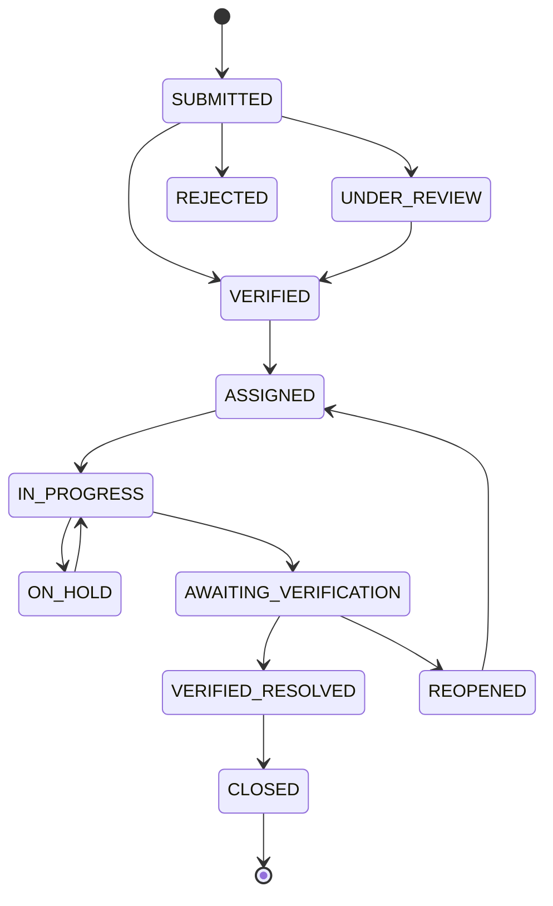

# CivicFix — Database Architecture & Data Dictionary

CivicFix implements a relational database schema designed for strict auditability, role-based security, geospatial indexing, and SLA tracking.

## Core Tables

| Table | Purpose | Key Attributes |
|---|---|---|
| `users` | Citizen and government accounts | `id, name, email, role, department_id, badge_number, active` |
| `departments` | Municipal agencies | `id, name, code, contact_email, active` |
| `categories` | Defect classifications | `id, name, slug, department_id, default_priority, sla_hours` |
| `service_areas` | Geographic jurisdiction zones | `id, name, zone_code, coordinates (GeoJSON)` |
| `issues` | Core civic incident records | `id, public_id, title, description, category, status, priority, latitude, longitude, address, reporter_id, department_id, assigned_officer_id, sla_deadline, resolved_at` |
| `issue_images` | Photographic evidence | `id, issue_id, url, image_type (EVIDENCE, BEFORE, AFTER), uploaded_by, caption` |
| `issue_comments` | Public comments & internal notes | `id, issue_id, user_id, content, is_internal` |
| `issue_status_history`| Immutable status audit trail | `id, issue_id, status, changed_by_id, note, timestamp` |
| `issue_assignments` | Officer dispatch logs | `id, issue_id, officer_id, assigned_by_id, notes, active` |
| `issue_escalations` | Departmental escalations | `id, issue_id, level, reason, escalated_by_id, status` |
| `sla_policies` | Service Level Agreement rules | `id, priority, target_response_hours, target_resolution_hours, auto_escalate_on_breach` |
| `notifications` | In-app push alert records | `id, user_id, title, message, notification_type, read` |
| `audit_logs` | Security and regulatory logs | `id, actor_id, actor_name, action, resource, resource_id, details, timestamp` |

## Issue Lifecycle State Machine

