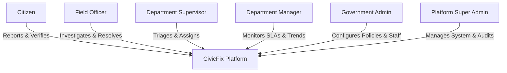

# CivicFix — User Roles & Permission Matrix

CivicFix implements a strict Role-Based Access Control (RBAC) model across citizen and municipal hierarchies:

## Role Permissions Matrix

| Feature / Action | CITIZEN | FIELD_OFFICER | DEPARTMENT_SUPERVISOR | DEPARTMENT_MANAGER | GOVERNMENT_ADMIN | SUPER_ADMIN |
|---|:---:|:---:|:---:|:---:|:---:|:---:|
| Report Problem & Upload Photos | ✅ | ✅ | ✅ | ✅ | ✅ | ✅ |
| Upvote / Endorse Issues | ✅ | ✅ | ✅ | ✅ | ✅ | ✅ |
| Verify Fix (Accept/Reopen) | ✅ | ❌ | ❌ | ❌ | ✅ | ✅ |
| Public Comments | ✅ | ✅ | ✅ | ✅ | ✅ | ✅ |
| Internal Government Notes | ❌ | ✅ | ✅ | ✅ | ✅ | ✅ |
| Start / Pause Work | ❌ | ✅ | ✅ | ❌ | ✅ | ✅ |
| Upload Before/After Photos | ❌ | ✅ | ✅ | ❌ | ✅ | ✅ |
| Mark Resolved | ❌ | ✅ | ✅ | ❌ | ✅ | ✅ |
| AI Field Copilot Brief | ❌ | ✅ | ✅ | ✅ | ✅ | ✅ |
| Assign / Reassign Officers | ❌ | ❌ | ✅ | ✅ | ✅ | ✅ |
| Department Triage Queue | ❌ | ❌ | ✅ | ✅ | ✅ | ✅ |
| Executive Analytics & Trends | ❌ | ❌ | ❌ | ✅ | ✅ | ✅ |
| Export Audit CSV Reports | ❌ | ❌ | ❌ | ✅ | ✅ | ✅ |
| User & Staff Management | ❌ | ❌ | ❌ | ❌ | ✅ | ✅ |
| Department & Category Setup | ❌ | ❌ | ❌ | ❌ | ✅ | ✅ |
| SLA Policy Configuration | ❌ | ❌ | ❌ | ❌ | ✅ | ✅ |
| View System Audit Logs | ❌ | ❌ | ❌ | ❌ | ✅ | ✅ |
| Full Platform Settings | ❌ | ❌ | ❌ | ❌ | ❌ | ✅ |

## Built-In Demo Accounts

| Role | Name | Email | Password | Assigned Department |
|---|---|---|---|---|
| **Citizen** | Maya Lin | `citizen@civicfix.org` | `password123` | Public Community |
| **Field Officer** | Marcus Vance | `officer@civicfix.org` | `password123` | Roads & Public Works (RPW-409) |
| **Department Supervisor** | Elena Rostova | `supervisor@civicfix.org` | `password123` | Roads & Public Works |
| **Department Manager** | David Sterling | `manager@civicfix.org` | `password123` | Roads & Public Works |
| **Government Admin** | Sarah Chen | `admin@civicfix.org` | `password123` | Municipal Administration |
| **Super Admin** | Alex Thorne | `superadmin@civicfix.org` | `password123` | Central Infrastructure |
